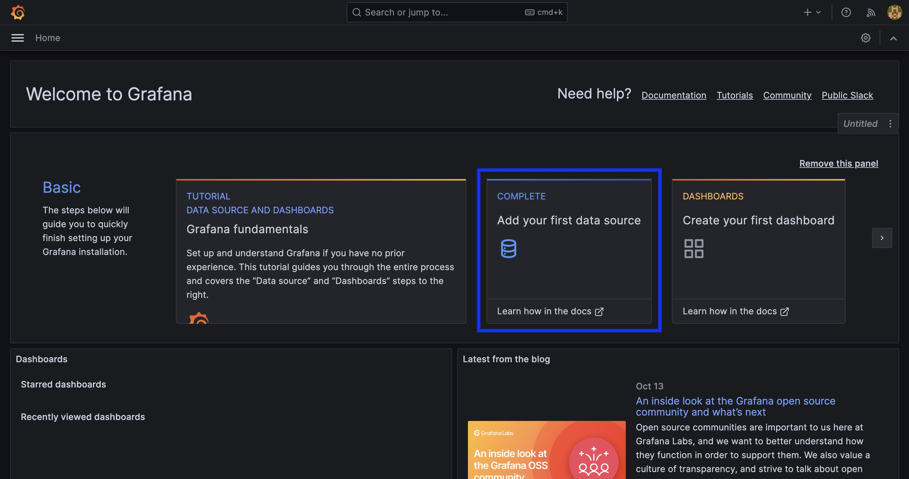
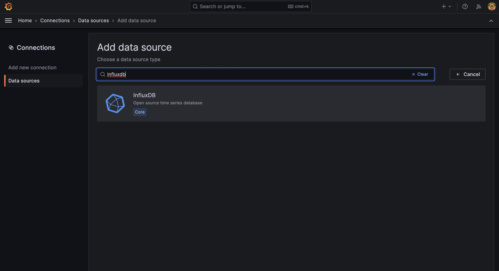
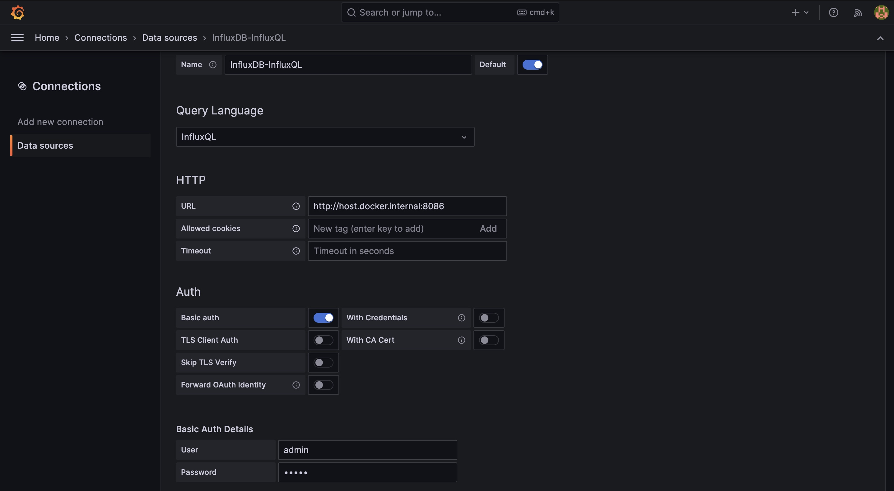
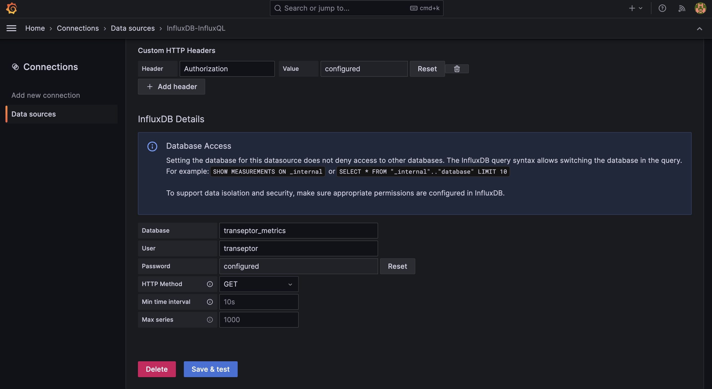
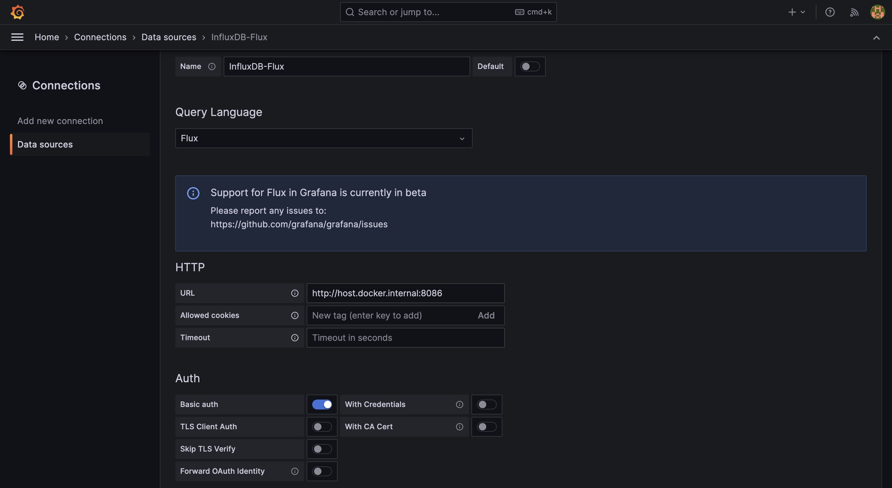
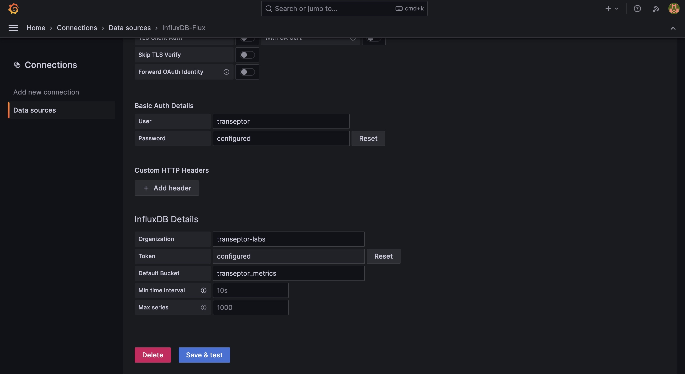
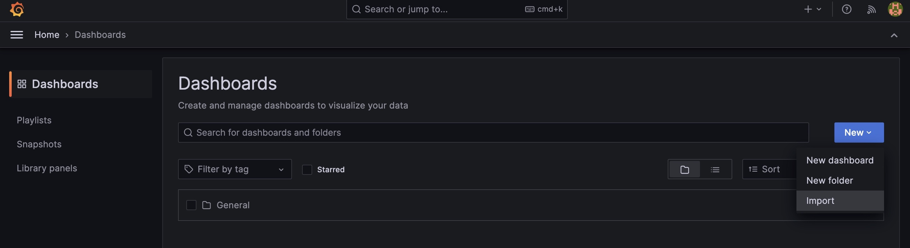
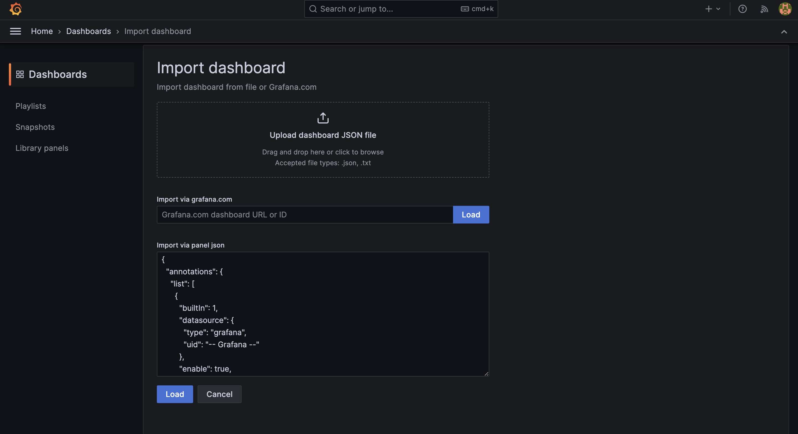
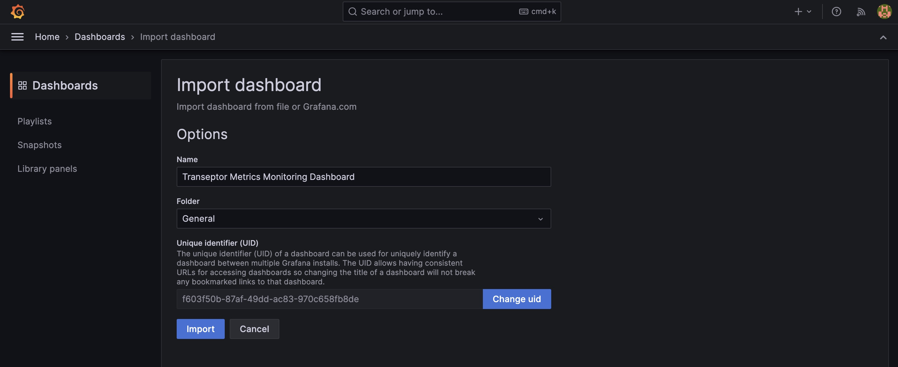

# Monitoring Transeptor with InfluxDB, Prometheus and Grafana

Metrics give insight into the bundler node to allow for performance tuning and debugging. Transeptor bundler can be configured to store metrics using a push(InfluxDB) and pull(Prometheus) metrics system. Grafana is used to visualize all the metrics.

## Requirements
1. Docker - `>= v20.10.17`
2. Docker Compose - `>= v2.10.2`
3. InfluxDB(docker image) - `influxdb:2.7.1`

## Setting up InfluxDB Docker

By default, InfluxDB is reachable at localhost:8086. We can use docker to run InfluxDB in a container.

1. Create a new directory to store your metrics data.
```bash
mkdir $PWD/influxdb-data
```

2. Use docker-compose in tool package to run InfluxDB in a docker container.
```bash
yarn influxdb
```

### Set up InfluxDB to store metrics
Once InfluxDB is running, we can create a database for our metrics by opening a shell in the InfluxDB container. By default InfluxDB can be reached at http:localhost:8086. We will use the CLI to set up InfluxDB an initial admin user, operator token, and bucket.

To use the influx command line interface, open a shell in the influxdb Docker container:
```bash
docker exec -it influxdb /bin/bash
```

The following example command is use to set up InfluxDB in non-interactive mode with an initial admin user, operator token, and bucket. For local development we use defaults user credentials below:

- username 'admin'
- password 'adminpwd'
- token 'ADMIN_TOKEN'
- org 'transeptor-labs'
- bucket 'transeptor_metrics'

```bash
influx setup \
  --username 'admin' \
  --password 'adminpwd' \
  --token 'ADMIN_TOKEN' \
  --org 'transeptor-labs' \
  --bucket 'transeptor_metrics' \
  --force
```

Now that we are all set up with the initial admin user let created a user for Transeptor node. For local development we use defaults user credentials below:

- username 'transeptor'
- password 'mydevpwd'

```bash
influx user create -n transeptor -p mydevpwd
```

Verify created entries with:
```bash
influx user list
```

Get the bucket ID for the bucket we created earlier for `transeptor_metrics`:
```bash
influx bucket list
```

Use the bucket ID to create a read token for the bucket with:
```bash
influx auth create \
  --org transeptor-labs \
  --read-bucket <your_bucket_id> \
  --write-bucket <your_bucket_id> \
  --user transeptor   
```

Copy the token value and save it for later use. The token value is used to configure a data source in Grafana and used in `.env` file for `TRANSEPTOR_INFLUX_TOKEN` value.

Leave InfluxDB shell.
```bash
exit
```

InfluxDB is now running and configured to store metrics for Transeptor.

## Setting up Prometheus Docker

coming soon
  
## Setting up Grafana Docker

By default, Grafana is reachable at `http://localhost:3000`. We can use docker to run Grafana in a container.

1. Create a new directory to store your metrics data.
```bash
mkdir $PWD/grafana-data
```

2. Use docker-compose in tool package to run Grafana in a container.
```bash
yarn grafana
```

Grafana can now be reached at `http://localhost:3000`

1. User your browser to navigate `http://localhost:3000` to access a visualization dashboard. 
2. On the sign in page, enter admin for username and password(username=`admin` password=`admin`).
3. Make sure to update the admin password when prompted.

### Adding Data sources
We will need to add a data source to Grafana for InfluxDB and Prometheus to visualize metrics. Follow these steps to add a data source to Grafana.

#### InfluxDB
Grafana supports two query languages for InfluxDB: InfluxQL and Flux. InfluxQL is the default query language for InfluxDB 1.x. Flux is the default query language for InfluxDB 2.0. We will add two data sources for InfluxDB, one for each query language.

**InfluxQL**
1. Navigate to `http://localhost:3000` and click on `Add your first data source`

2. Select `InfluxDB` as the data source

3. Configure the data source with the following values:
  - Name: `InfluxDB-InfluxQL`
  - Query Language: `InfluxQL`
  - URL: `http://host.docker.internal:8086`
  - Auth: toggle on `Basic Auth`
  - Basic Auth Details: add username and password for InfluxDB admin user(username=`admin` password=`adminpwd`)
  - Custom HTTP Headers: Header=`Authorization` Value=`Token <ADMIN_TOKEN>`
  - InfluxDB Details: Database=`transeptor_metrics`, User=`transeptor`, Password=`mydevpwd`, HTTP Method=`GET`


4. Click `Save & Test` to save the data source and test the connection.


You should see a green `Data source is working` message if the connection is successful.

**Flux**
1. Navigate to `http://localhost:3000` and click on `Add your first data source`

2. Select `InfluxDB` as the data source

3. Configure the data source with the following values:
  - Name: `InfluxDB-Flux`
  - Query Language: `Flux`
  - URL: `http://host.docker.internal:8086`
  - Auth: toggle on `Basic Auth`
  - Basic Auth Details: add username and password for InfluxDB transeptor user(username=`transeptor` password=`mydevpwd`)
  - InfluxDB Details: Organization=`transeptor-labs`, Token=`<YOUR_TOKEN_FOR_TRANSEPTOR_USER>`, Default Bucket=`transeptor_metrics`


4. Click `Save & Test` to save the data source and test the connection.


You should see a green `Data source is working` message if the connection is successful.

#### Prometheus

- Prometheus: https://grafana.com/docs/grafana/latest/datasources/prometheus/

### Importing Dashboards
We will import a dashboard to visualize metrics for Transeptor. Follow these steps to import a dashboard to Grafana.



For a Transeptor InfluxDB monitoring dashboard; you can import using `Import via panel json`. Copy json data in `./docs/metrics/dashboards/transeptor-metrics-v1.json` into `Import via panel json` section and click `Load`.


One the final import page select which folder to import the dashboard into and click `Import`. You can use the default name or change it to something else.


Once the dashboard is imported, you can view it by clicking on the dashboard name. Now just start up transeptor with metrics enabled and you should see metrics in the dashboard.
