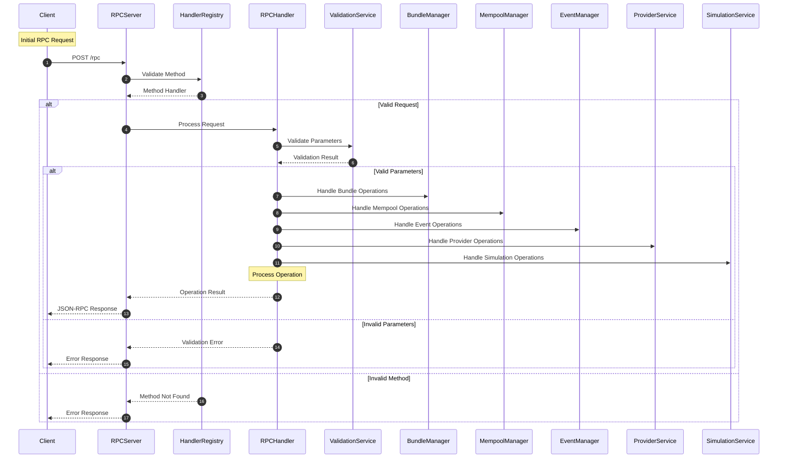

# Internal Architecture

## Overview
This document provides a comprehensive overview of the Transeptor Bundler's internal architecture and component interactions.

## Prerequisites
- Understanding of Ethereum and Account Abstraction (ERC-4337)
- Basic knowledge of TypeScript and Node.js

## Request Flow Architecture

The Request Flow Architecture diagram illustrates the path of an incoming RPC request through the system. It shows how requests are validated, routed to appropriate handlers, and how different services coordinate to process the request. The diagram also demonstrates the error handling flow for invalid requests or methods.

## Core Components

### 1. RPC Server (`src/rpc/rpc-server.ts`)
- Handles incoming HTTP requests
- Routes requests to appropriate handlers
- Manages server lifecycle (start/stop)

### 2. Handler Registry (`src/rpc/bundler-handler-registry.ts`)
- Maps RPC methods to their handlers
- Validates method existence
- Manages supported API namespaces
- Forwards specific handler function to the correct API namespace

### 3. RPC Handler (`src/rpc/rpc-handler.ts`)
- Processes individual RPC requests
- Coordinates with validated JsonRpc specific handler function to resolve the request
- Handles error cases when a specific handler returns an error response

### 4. Validation Service (`src/validation/validation-service.ts`)
- Validates request parameters
- Ensures data integrity
- Provides type safety

### 5. Bundle Manager (`src/bundle/bundle-manager.ts`)
- Manages user operation bundles
- Handles bundle creation and processing
- Coordinates with mempool
- Manages bundling intervals
- Handles bundle submission

### 6. Bundle Builder (`src/bundle/bundle-builder.ts`)
- Creates bundles from pending operations
- Validates entity reputation
- Handles bundle simulation
- Manages bundle size limits

### 7. Bundle Processor (`src/bundle/bundle-processor.ts`)
- Processes and submits bundles
- Handles transaction signing
- Manages bundle submission
- Updates reputation after submission

### 8. Mempool Manager (`src/mempool/mempool-manager.ts`)
- Manages pending user operations
- Handles mempool operations
- Coordinates with bundle manager
- Maintains operation queue

### 9. Event Manager (`src/event/event-manager-with-reputation.ts`)
- Manages system events
- Handles reputation tracking
- Coordinates with other services
- Manages reputation scores

### 10. Provider Service (`src/provider/provider-service.ts`)
- Manages Ethereum provider interactions
- Handles blockchain communication
- Provides blockchain state information
- Handles transaction simulation

### 11. Simulation Service (`src/sim/sim.ts`)
- Handles user operation simulation
- Validates operation execution
- Calculates gas estimates
- Manages simulation state
- Provides simulation results

### 12. Reputation Manager (`src/reputation/reputation-manager.ts`)
- Manages entity reputation scores
- Handles reputation updates
- Enforces reputation rules
- Manages whitelist/blacklist
- Performs hourly reputation decay

## Additional Resources

- [ERC-4337 Specification](https://eips.ethereum.org/EIPS/eip-4337)
- [ERC-7562 Specification](https://eips.ethereum.org/EIPS/eip-7562)
