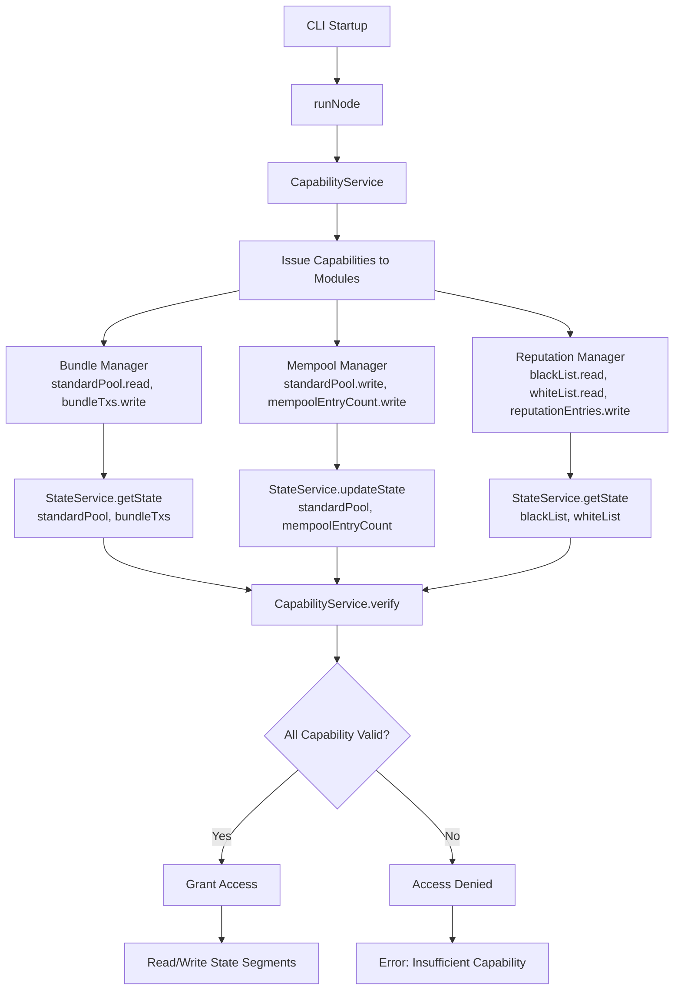

# Object Capability based Access Control for internal resources

Transeptor uses a globally accessible in-memory data structure via `StateService`. The `StateService` exposes an public interface to allows modules to mutate or read the `state` given a key or list of keys.

While this provides great flexibility for general-purpose state transitions, it poses a serious risk: any module can accidentally or maliciously mutate or delete critical state segments (e.g., clearing the entire mempool).

To mitigate this risk, the `StateService` enforces a object capability access control pattern(OCAP) using signed `Capability objects` that are issued to each module that requires `state` access at startup. This will restrict modules to updating only explicitly permitted parts of the state.

## How it works

The second signers on the bundlers `TRANSEPTOR_MNEMONIC` will be responsible for signing Capabilities at startup.

1. At node start up a central `OCAPS` service issues signed capabilities to each module that requires access to `state` via the `CapabilityService`.
2. When a module needs to access `state` is uses either `StateService.getState()` or `StateService.updateState`, providing the key to access along with a granted capability object
3. The `StateService` will call `CapabilityService` to verify the signed capability before granting read/write access to the state segments.

